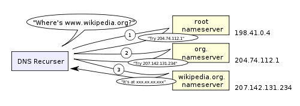

# Web 是如何工作的

当我们在浏览器中输入 google.com 背后发生了什么？

**目录**

- [Google的'g'被按下时](#Google的'g'被按下时)
- [当你输入'Enter'](#当你输入'Enter')
- [解析URL](#解析URL)
- [检查HSTS列表（已废弃）](#检查HSTS列表（已废弃）)
- [DNS查询](#DNS查询)
- [打开一个套接字+TLS握手](#打开一个套接字+TLS握手)
- [HTTP 协议](#HTTP协议)
- [HTTP 服务请求处理](#HTTP服务请求处理)
- [服务器响应](#服务器响应)
- [浏览器的幕后花絮](#浏览器的幕后花絮)
- [浏览器的上层结构](#浏览器的上层结构)
- [渲染引擎](#渲染引擎)
- [主处理流程](#主处理流程)
- [解析基础内容](#解析基础内容)
- [DOM 树](#DOM树)
  - [为什么 DOM 很慢?](#为什么DOM很慢?)
- [渲染树](#渲染树)
- [渲染树与 DOM 树的关系](#渲染树与DOM树的关系)
- [CSS 解析](#CSS解析)
- [布局](#布局)
- [绘制](#绘制)
- [小彩蛋](#小彩蛋)
  - [网络的诞生](#网络的诞生)

## Google的'g'被按下时

在你按下 "g" 的时候，浏览器就会收到这个事件，整个自动化的机制就会进入高速运转状态。根据你的浏览器算法，以及你是否处于私人/隐身模式，各种建议将在 URL 栏下面的提示框呈现给你。这些算法大多根据搜索历史和书签对结果进行优先排序。你将输入 "google.com"，所以这些都不重要，但在你输入完成之前，会有很多代码在运行，浏览器的建议也会随着每一次按键输入而被完善。它甚至可能在你输入 “google.com” 之前就建议你输入它。

## 当你输入'Enter'

为了选择一个起始点，让我们选择在键盘上的回车键被按下到其范围的底部。在这个时候，一个专门针对回车键的电路被关闭（直接或电容式）。这允许少量的电流流入键盘的逻辑电路，扫描每个按键开关的状态，同时消除开关快速间歇性关闭的电气噪声，并将其转换为按键代码的整数，在这个例子中为13。然后，键盘控制器对键码进行编码，以便传送到计算机上。现在几乎普遍是通过通用串行总线（USB）或蓝牙进行连接。

对于 USB 键盘来说：

* 产生的键码由内部键盘电路存储器储存在一个称为 "endpoint" 的寄存器中
* 主机 USB 控制器每隔10毫秒就会轮询该 "endpoint"，所以它能得到存储在上面的键码值
* 这个值会送到 USB SIE（串行接口引擎），以最大速度 1.5 Mb/s（USB 2.0）发送
* 然后这个串行信号在计算机的主机 USB 控制器处被解码，并由计算机的人机接口设备（HID）通用键盘设备驱动程序进行解释
* 之后键值被传入操作系统的硬件抽象层

对于触摸屏键盘来说：

* 当用户将手指放在现代电容式触摸屏上时，少量的电流会被转移到手指上。这通过导电层的静电场构成了电路，并在屏幕上的那个点产生了电压降。然后，屏幕控制器产生一个中断，报告 "点击" 的坐标
* 然后，移动操作系统将其 GUI 元素（现在是虚拟键盘应用按钮）中的一个点击事件通知当前的应用程序
* 虚拟键盘现在可以触发一个软件中断，用于向操作系统发送 "按键被按下" 的信息
* 这个中断通知当前的应用程序有一个 "按键被按下" 事件

## 解析URL

浏览器现在的URL（统一资源定位器）中包含了以下信息。

* 协议 "http" ：使用 "超文本传输协议"
* 资源 "/"：检索主（索引）页

当没有给出协议或有效域名时，浏览器就会将地址框中的文本输入到浏览器的默认网络搜索引擎中。（注：不同浏览器处理机制可能不同）

## 检查HSTS列表（已废弃）

* ~浏览器检查其 "预装 HSTS（HTTP严格传输安全）" 列表。这是一个要求只通过 HTTPS 联接的网站列表~
* ~如果该网站在列表中，浏览器通过 HTTPS 而不是 HTTP 发送请求。否则，初始请求将通过 HTTP 发送~

注意：网站仍然可以使用 HSTS 策略而不在 HSTS 列表中。用户对网站的第一个HTTP请求将收到一个响应，要求用户只发送 HTTPS 请求。然而，这个单一的 HTTP 请求有可能使用户受到[降级攻击](http://www.yourdictionary.com/downgrade-attack)，这就是现代网络浏览器中包含HSTS列表的原因。

现代浏览器要求首先请求 https。


## DNS查询

浏览器试图找出所输入域名的IP地址。DNS查询的过程如下：

* **浏览器缓存：**浏览器会将DNS记录缓存一段时间。有趣的是，操作系统并没有告诉浏览器每个 DNS 记录的生存时间，因此，浏览器将它们缓存在一个固定的时间内（不同的浏览器之间有所不同，2 - 30分钟）
* **操作系统的缓存：**如果浏览器的缓存不包含所需的记录，浏览器会进行系统调用（Windows 中的 gethostbyname）。操作系统有自己的缓存。
* **路由器缓存：**请求继续到你的路由器，它通常有自己的DNS缓存。
* **ISP DNS 缓存：**检查的下一个地方是缓存 ISP 的 DNS 服务器。有了缓存，自然就有了。
* **递归搜索：**您的 ISP 的 DNS 服务器开始进行递归搜索，从根名称服务器，通过 .com 顶级名称服务器，到谷歌的名称服务器。通常情况下，DNS 服务器在缓存中会有 .com 名称服务器的名称，因此，没有必要访问根名称服务器。

下面是一个递归DNS搜索的示意图：

<p align="center">
  
</p>

关于 DNS 的一个令人担忧的事情是，像 wikipedia.org 或 facebook.com 这样的整个域名似乎都映射到一个单一的IP地址。幸运的是，有一些方法可以缓解这个瓶颈：

* **Round-robin DNS** 是一种解决方案，DNS 查询返回多个 IP 地址，而不是只有一个。例如，facebook.com 实际上映射到四个 IP 地址。
* **负载平衡器**是在一个特定的 IP 地址上监听并将请求转发给其他服务器的硬件。大型网站通常会使用昂贵的高性能负载平衡器。
* **地理 DNS **根据客户的地理位置，将域名映射到不同的 IP 地址，从而提高可扩展性。这对于托管静态内容非常友好，这样不同的服务器就不必更新共享状态。
* **Anycast** 是一种路由技术，一个 IP 地址映射到多个物理服务器。不幸的是，任意播送并不适合 TCP，因此很少在这种情况下使用。

大多数 DNS 服务器本身使用任意广播来实现 DNS 查询的高可用性和低延迟。任意广播服务的用户（DNS 是一个很好的例子）将总是连接到 "最近的"（从路由协议的角度）DNS 服务器。这减少了延迟，并提供了一定程度的负载平衡（假设你的消费者均匀地分布在你的网络中）。

## 打开一个套接字+TLS握手

* 一旦浏览器收到目标服务器的 IP 地址，它就会从 URL 中获取该地址和给定的端口号（HTTP 协议默认为 80 端口，HTTPS 为 443 端口），并调用系统库中名为 socket 的函数，请求一个[TCP](http://www.webopedia.com/TERM/T/TCP.html) 连接。
* 客户端计算机向服务器发送一个 ClientHello 消息，其中包括其 TLS 版本、密码算法列表和可用的压缩方法。
* 服务器用一个 ServerHello 消息回复客户端，其中包括 TLS 版本、选择的密码、选择的压缩方法以及由CA（证书颁发机构）签署的服务器公共证书。该证书包含一个公钥，客户端将使用该公钥对握手的其余部分进行加密，直到可以商定一个对称密钥。
* 客户端根据其信任的 CA 列表验证服务器的数字证书。如果可以根据 CA 建立信任，客户端会生成一串伪随机字节，并用服务器的公钥对其进行加密。这些随机字节可以用来确定对称密钥。
* 服务器使用其私钥对随机字节进行解密，并使用这些字节来生成自己的对称主密钥副本。
* 客户端向服务器发送一个完成的消息，用对称密钥加密到此为止的传输的哈希值。
* 服务器生成自己的哈希值，然后解密客户端发送的哈希值，以验证它是否匹配。如果匹配，它就向客户发送自己的Finished信息，也是用对称密钥加密的。
* 从现在开始，TLS 会话传输的应用程序（HTTP）数据是用商定的对称密钥加密的。

## HTTP协议


你可以非常肯定，像 Facebook/Gmail 这样的动态网站不会从浏览器缓存中得到服务，因为动态网页要么很快过期，要么立即过期（过期日期设置为过去）。

如果使用的网络浏览器是由谷歌编写的，那么它将发送一个请求，试图与服务器协商从 HTTP "升级" 到 SPDY 协议，而不是发送HTTP请求来检索该页面。请注意，在最新版本的 Chrome 浏览器中，SPDY 正在被废弃，而改用 HTTP/2。

```txt
GET http://www.google.com/ HTTP/1.1
Accept: application/x-ms-application, image/jpeg, application/xaml+xml, [...]
User-Agent: Mozilla/4.0 (compatible; MSIE 8.0; Windows NT 6.1; WOW64; [...]
Accept-Encoding: gzip, deflate
Connection: Keep-Alive
Host: google.com
Cookie: datr=1265876274-[...]; locale=en_US; lsd=WW[...]; c_user=2101[...]
```

GET 请求命名了要获取的URL："http://www.google.com/"。浏览器自己的标识（User-Agent 头部），并说明它将接受何种类型的响应（Accept 和 Accept-Encoding 头部）。连接头要求服务器为进一步的请求保持 TCP 连接。

该请求还包含浏览器对该域的 cookies。正如你可能已经知道的，cookies 是键值对，在不同的页面请求之间跟踪网站的状态。于是，cookies 存储了登录用户的名字、服务器分配给用户的一个秘密号码、用户的一些设置等。这些 cookies 将被储存在客户端的一个文本文件中，并在每次请求时被发送到服务器。

HTTP/1.1定义了 "close" 连接选项，供发送者发出信号，表示在响应完成后将关闭该连接。例如，Connection: close。

在发送完请求和标头后，网络浏览器向服务器发送一个空白换行，表示请求的内容已经完成。服务器用一个表示请求状态的响应代码进行响应，并以如下形式进行回应。**200 OK [响应头部]**

后面是一个换行，然后发送一个 HTML 内容的有效载荷 www.google.com。然后，服务器可以关闭连接，或者如果客户端发送的头信息要求连接保持，则保持连接开放，以便为进一步的请求重新使用。

如果网络浏览器发送的 HTTP 头包括足够的信息，使网络服务器能够确定网络浏览器缓存的文件版本自上次检索以来是否未被修改（即如果网络浏览器包括一个 ETag 头），它可能会以一种形式的请求来回应。**304 Not Modified [响应头部]**，没有有效载荷，而网络浏览器则从其缓存中检索 HTML。

在解析了HTML之后，网络浏览器（和服务器）对 HTML 页面引用的每一个资源（图像、CSS、favicon.ico 等）重复这一过程，只是请求不是 GET / HTTP/1.1，而是**GET /$（URL相对于 www.google.com） HTTP/1.1.**。

如果 HTML 引用了一个不同于 www.google.com 的域名上的资源，网络浏览器就会回到解析其他域名的步骤中，并遵循该域名到此为止的所有步骤。请求中的Host 标头将被设置为适当的服务器名称，而不是 google.com。

**Gotcha:**

* URL "http://facebook.com/" 中的尾部斜线很重要。在这种情况下，浏览器可以安全地添加斜线。对于形式为 http://example.com/folderOrFile 的URL，浏览器不能自动添加斜杠，因为它不清楚 folderOrFile 是一个文件夹还是一个文件。在这种情况下，浏览器将访问没有斜杠的URL，而服务器将以重定向的方式回应，导致不必要的往返。
* 服务器可能会用一个 301 永久移动的响应来告诉浏览器去 "http://www.google.com/" 而不是 "http://google.com/"。服务器坚持重定向而不是立即响应用户想看的网页，有一些有趣的原因。
 一个原因是与搜索引擎的排名有关。如果同一个页面有两个 URL，比如说 http://www.vasanth.com/ 和 http://vasanth.com/，搜索引擎可能会认为它们是两个不同的网站，每个网站的传入链接都比较少，因此排名比较低。搜索引擎理解永久重定向（301），并会将两个来源的传入链接合并为一个排名。
另外，同一内容的多个URL对缓存不友好。当一个内容有多个名字时，它将有可能在缓存中出现多次。

**注意:**
HTTP响应以服务器返回的状态代码开始。以下是对状态代码所表示的内容的一个非常简短的总结。

  * 1xx 表示仅是一个信息性信息
  * 2xx 表示某种程度上的成功
  * 3xx 将客户端重定向到另一个URL
  * 4xx 表示客户端方面有错误
  * 5xx 表示服务器方面有错误

## HTTP服务请求处理

HTTPD（HTTP Daemon）服务器是处理服务器上的请求/响应的服务器。最常见的 HTTPD 服务器是 Linux 的 Apache 或 nginx 和 Windows的IIS。

* HTTPD (HTTP Daemon) 接收请求

* 服务器将请求分解为以下参数：
    * HTTP 请求方法（GET、POST、HEAD、PUT 和 DELETE）。如果是直接在地址栏输入的 URL，这将是 GET
    * 域名，在本文例子中是 - google.com
    * 要求的路径/页面，在本文例子中是  - /（因为没有要求具体的路径/页面，/ 是默认路径）
    * 服务器验证，在服务器上配置了一个与 google.com 相对应的虚拟主机

* 服务器验证了 google.com 可以接受 GET 请求

* 服务器验证客户是否被允许使用这种方法（通过 IP、认证等）

* 如果服务器安装了重写模块（如 Apache 的 mod_rewrite 或 IIS 的 URL Rewrite），它会尝试将请求与配置的规则之一进行匹配。如果找到一个匹配的规则，服务器会使用该规则重写请求

* 服务器去拉取与请求相对应的内容，在我们的例子中，它将回落到索引文件，因为 "/" 是主文件（有些情况可以覆盖这一点，但这是最常见的方法）

* 服务器根据请求处理程序来解析文件。请求处理程序是一个程序（在 ASP.NET、PHP、Ruby 中......），它读取请求并为响应生成 HTML。如果 Google 是在PHP 上运行的，服务器使用 PHP 来解释索引文件，并将输出流向客户端

注：每个动态网站都面临的一个有趣的困难是如何存储数据。较小的网站通常会有一个单一的 SQL 数据库来存储他们的数据，但存储大量数据和/或有许多访问者的网站必须找到一种方法，将数据库分割到多个机器上。解决方案包括分片（根据主键将一个表分割到多个数据库中）、复制以及使用具有弱化一致性语义的简化数据库。

## 服务器响应

下面是服务器生成并发回的响应：

```txt
HTTP/1.1 200 OK
Cache-Control: private, no-store, no-cache, must-revalidate, post-check=0,
    pre-check=0
Expires: Sat, 01 Jan 2000 00:00:00 GMT
P3P: CP="DSP LAW"
Pragma: no-cache
Content-Encoding: gzip
Content-Type: text/html; charset=utf-8
X-Cnection: close
Transfer-Encoding: chunked
Date: Fri, 12 Feb 2010 09:05:55 GMT

2b3
��������T�n�@����[...]
```

整个响应是36 kB，其中大部分在我修剪过的最后的字节块中。

**Content-Encoding** 头告诉浏览器，响应体是用 gzip 算法压缩的。解压缩 blob 后，你会看到你所期望的 HTML：

```html
<!DOCTYPE html PUBLIC "-//W3C//DTD XHTML 1.0 Strict//EN"
      "http://www.w3.org/TR/xhtml1/DTD/xhtml1-strict.dtd">
<html xmlns="http://www.w3.org/1999/xhtml" xml:lang="en"
      lang="en" id="google" class=" no_js">
<head>
<meta http-equiv="Content-type" content="text/html; charset=utf-8" />
<meta http-equiv="Content-language" content="en" />
...
```

请注意将 Content-Type 设置为 text/html 的标头。该标头指示浏览器将响应内容呈现为 HTML，而不是说将其下载为文件。浏览器将使用该标头来决定如何解释响应，但也会考虑其他因素，如 URL 的扩展。

## 浏览器的幕后花絮

一旦服务器向浏览器提供资源（HTML、CSS、JS、图像等），就会经历以下过程：

* 解析 HTML, CSS, JS
* 渲染 - 构建 DOM 树 → 渲染树 → 渲染树的布局 → 绘制渲染树

## 浏览器的上层结构

1. **用户接口：**包括地址栏、后退/前进按钮、书签菜单等。浏览器显示的每一个部分，除了你看到请求的页面的窗口。
2. **浏览器引擎：** [Marshals](http://stackoverflow.com/a/5600887/1672655) UI 和渲染引擎之间的动作。
3. **渲染引擎：**负责显示请求的内容。例如，渲染引擎解析 HTML 和 CSS，并在屏幕上显示解析后的内容。
4. **网络：**对于网络调用，如HTTP请求，为不同的平台使用不同的实现（在一个平台独立的接口后面）。
5. **UI 后端：**用于绘制基本部件，如组合框和窗口。这个后端提供了不针对平台的通用接口。在底层它是使用操作系统的用户接口方法。
6. **JavaScript 引擎：**用于解析和执行 JavaScript 代码的解释器。
7. **数据存储：**这是一个持久性层。浏览器可能需要将数据保存在本地，例如 cookie。浏览器也支持存储机制，如 [localStorage](https://developer.mozilla.org/en-US/docs/Web/API/Window/localStorage)、[IndexedDB](https://developer.mozilla.org/en-US/docs/Web/API/IndexedDB_API/Using_IndexedDB) 和 [FileSystem](https://developer.chrome.com/apps/fileSystem)。

<p align="center">
  
</p>


让我们从最简单的情况开始：一个有一些文字和一张图片的普通 HTML 页面。浏览器需要做什么来处理这个简单的页面呢？

1. **转换：**浏览器从磁盘或网络上读取 HTML 的原始字节，并根据文件的指定编码（如 UTF-8）将其转换为单个字符。

2. **标记化：**浏览器将字符串转换为 W3C HTML5 标准规定的不同标记--例如 "<html>"、"<body>" 和 "角括号" 内的其他字符串。每个标记都有一个特殊的含义和一套规则。

3. **词法分析：**发出的标记被转换为 "对象"，定义其属性和规则。**Lexing:** the emitted tokens are converted into “objects” which define their properties and rules.

4. **DOM结构：**最后，由于 HTML 标记定义了不同标记之间的关系（有些标记包含在标记中），因此创建的对象被链接在一个树形数据结构中，该结构也捕捉到了原始标记中定义的父子关系。HTML 对象是 body 对象的父对象，body 是段落对象的父对象，以此类推。

<p align="center">
  
</p>

整个过程的最终输出是文档对象模型，或者说是我们这个简单页面的 "DOM"，浏览器使用它来进一步处理这个页面。

浏览器每次处理 HTML 标记时，都必须经过上述所有步骤：将字节转换成字符，识别标记，将标记转换成节点，并建立 DOM 树。这整个过程可能需要一些时间，特别是当我们有大量的 HTML 需要处理时。

<p align="center">
  
</p>

如果你打开 Chrome DevTools，在页面加载时记录一条时间线，你可以看到执行这一步骤的实际时间--在上面的例子中，我们将一大块 HTML 字节转换为 DOM 树花了大约 5ms。当然，如果页面比较大，就像大多数页面一样，这个过程可能需要更长的时间。你会在我们未来关于创建流畅动画的章节中看到，如果浏览器必须处理大量的 HTML，这很容易成为你的瓶颈。

## 渲染引擎

渲染引擎是一个软件组件，它接收标记过的内容（如 HTML、XML、图像文件等）和格式化信息（如 CSS、XSL 等），并在屏幕上显示格式化的内容。

| 浏览器            |           引擎            |
| ----------------- | :-----------------------: |
| Chrome            | Blink (WebKit 的一个分支) |
| Firefox           |           Gecko           |
| Safari            |          Webkit           |
| Opera             |  Blink (Presto if < v15)  |
| Internet Explorer |          Trident          |
| Edge              | Blink (EdgeHTML if < v79) |

WebKit 是一个开源的渲染引擎，最初是为 Linux 平台开发的引擎，后来被苹果公司修改为支持 Mac 和 Windows。

渲染引擎是单线程的。除了网络操作之外，几乎所有的事情都发生在一个单线程中。在 Firefox 和 Safari 中，这是浏览器的主线程。在 Chrome 中，它是标签进程的主线程。

网络操作可以由几个平行线程同时执行。但并行连接的数量是有限的（通常每个主机名有 6-13 个连接）。

浏览器的主线程是一个事件循环。它是一个无限的循环，使得进程保活。它等待事件（如布局和绘画事件）并处理它们。

注意：Chrome 等浏览器运行多个渲染引擎的进程实例：每个标签都有一个。每个标签在一个单独的进程中运行。

## 主处理流程

渲染引擎将开始从网络层获取所请求的文件的内容。这通常是以 8KB 的小块来完成的。

之后，渲染引擎的基本流程是：

<p align="center">
  
</p>

渲染引擎将开始解析 HTML 文档，并将元素转换为 [DOM](http://domenlightenment.com/) 树中的节点，称为 **"内容树"**。

该引擎将解析样式数据，包括外部 CSS 文件和样式元素中的数据。样式信息和 HTML 中的视觉指令将被用来创建另一棵树：**渲染树**。

下一个阶段是**绘画**——渲染树将被遍历，每个节点将使用UI后端层进行绘画。

重要的是要明白，这是一个渐进的过程。为了获得更好的用户体验，渲染引擎会尽可能快地在屏幕上显示内容。它不会等到所有的 HTML 都被解析后才开始构建和布局渲染树。部分内容将被解析并显示出来，而这个过程将继续处理不断来自网络的其他内容。

以下是 Webkit 的流程:

<p align="center">
  
</p>


## 解析基础内容

**解析：**将文档翻译成代码可以使用的结构。解析的结果通常是一棵代表文档结构的节点树

**语法：**解析是基于文件所遵守的语法规则：它所使用的语言或格式。你可以解析的每一种格式都必须有确定的语法，由词汇和语法规则组成。它被称为**无语境语法**。

解析可以分为两个子过程：词法分析和语法分析。

**词汇分析：**将输入内容分解为标记的过程。标记是语言词汇：有效构件的集合。

**语法分析：**语言语法规则的应用。

解析器通常在两个部分之间进行分工：负责将输入内容分解为有效的标记的词法分析器（有时称为标记器），以及负责根据语言语法规则分析文档结构来构建解析树的解析器。词汇器知道如何剥离无关的字符，如空白和换行符。

<p align="center">
  
</p>

解析过程是反复进行的。解析器通常会向词法解析器询问一个新的标记，并尝试将该标记与某个语法规则相匹配。如果一个规则被匹配，一个与该标记对应的节点将被添加到解析树中，解析器将要求提供另一个标记。

如果没有匹配的规则，解析器将在内部存储令牌，并继续询问令牌，直到找到与所有内部存储的令牌匹配的规则。如果没有找到规则，那么解析器将引发一个异常。这意味着该文件是无效的，含有语法错误。

HTML 解析器的工作是将 HTML 标记解析成一个解析树。HTML 的定义是采用 DTD（文档类型定义）格式。这种格式是用来定义 SGML 家族的语言的。该格式包含所有允许的元素、它们的属性和层次结构的定义。正如我们前面所看到的，HTML 的 DTD 并没有形成一个无语境的语法。

HTML解析算法由两个阶段组成：标记化和树结构构建。

**标记化**是词法分析，将输入内容解析为标记。在 HTML 标记中，有开始标记、结束标记、属性名和属性值。标记化器识别出标记，将其交给树形构造器，并消耗下一个字符来识别下一个标记，以此类推，直到输入的结束。

<p align="center">
  
</p>


## DOM树

输出树（"解析树"）是一棵 DOM 元素和属性节点的树。DOM（Document Object Model） 是文档对象模型的简称。它是 HTML 文档的对象呈现，也是 HTML 元素与外界的接口，如 JavaScript。树的根是 "文档 "对象。

DOM与标记几乎是一对一的关系。比如说：

```html
<html>
  <body>
    <p>
      Hello World
    </p>
    <div> </div>
  </body>
</html>
```

这个标记将被翻译成以下DOM树：

<p align="center">
  
</p>


### 为什么DOM很慢?

简短的回答是，DOM 并不慢。添加和删除一个 DOM 节点只是几个指针的交换，并不比在 JS 对象上设置一个属性多多少。

然而，布局很慢。当你以任何方式触摸 DOM 时，你在整个树上设置了一个脏位，告诉浏览器它需要再次弄清所有东西的位置。当 JS 将控制权交还给浏览器时，它就会调用它的布局算法（或者更准确地说，它调用了 CSS 的重新计算算法，然后是布局，然后是重绘，然后是重新组合）来重新绘制屏幕。布局算法相当复杂--阅读 CSS 规范以了解其中的一些规则--这意味着它经常要做出非本地的决定。

更糟糕的是，布局是通过访问某些属性来同步触发的。其中包括 getComputedStyleValue()、getBoundingClientWidth()、.offsetWidth、.offsetHeight 等，这使得它们很容易被碰到。完整的列表是[这里]（https://gist.github.com/paulirish/5d52fb081b3570c81e3a）。

正因为如此，很多 Angular 和 JQuery 的代码都是非常的慢。在移动设备上，一个布局就会耗尽你的整个框架预算。当我在 2013 年测量 Google Instant 时，它在一次查询中造成了 13 个布局，并在移动设备上锁定了近 2 秒的屏幕。(后来它被加速了)

React 并不能帮助加速布局--如果你想在移动网络浏览器上获得黄油般顺滑的动画，你需要借助其他技术，比如将你在一个框架中的所有操作限制在可以在 GPU 上执行的操作。但它所做的是确保在你每次更新页面状态时，最多只执行一次布局。这通常是对现状的一个很大的改进。

## 渲染树

在构建 DOM 树的同时，浏览器还构建了另一棵树，即渲染树。这棵树是由视觉元素组成的，并按照它们将被显示的顺序排列。它是文档的视觉表现。这棵树的目的是为了能够按照正确的顺序绘制内容。

渲染器知道如何布局和绘制自己及其子代。每个呈现器代表一个矩形区域，通常对应于一个节点的 CSS 框。

## 渲染树与 DOM 树的关系

渲染器对应于 DOM 元素，但这种关系并不是一对一的。非可视化的 DOM 元素不会被插入到呈现树中。一个例子是 "head" 元素。另外，显示值被指定为 "none" 的元素也不会出现在树中（而具有 "隐藏 "可见性的元素会出现在树中）。

有一些 DOM 元素对应着几个视觉对象。这些通常是具有复杂结构的元素，不能用一个矩形来描述。例如，"选择 "元素有三个渲染器：一个用于显示区域，一个用于下拉列表框，一个用于按钮。另外，当文本因为宽度不足以容纳一行而被分成多行时，新的一行将被添加为额外的渲染器。

一些渲染对象对应于一个 DOM 节点，但不在树中的同一位置。浮动和绝对定位的元素脱离了流程，被放置在树的不同部分，并被映射到真正的框架。一个占位框就是它们本该在的地方。

<p align="center">
  
</p>

在 WebKit 中，解析样式和创建渲染器的过程被称为 "attachment"。每个 DOM 节点都有一个 "attach" 方法。附加是同步的，节点插入到 DOM 树中会调用新节点的 "attach" 方法。

建立渲染树需要计算每个渲染对象的视觉属性。这是通过计算每个元素的样式属性来实现的。样式包括各种来源的样式表、内联样式元素和 HTML 中的视觉属性（如 "bgcolor "属性）。后者被翻译成匹配的 CSS 样式属性。

## CSS解析

浏览器引擎从右到左匹配 CSS 选择器。请记住，当浏览器进行选择器匹配时，它有一个元素（它试图确定样式的元素）和你所有的规则及其选择器，它需要找到哪些规则与该元素相匹配。这与通常的 jQuery 不同，比如说，你只有一个选择器，你需要找到所有与该选择器匹配的元素。

一个选择器的特异性（specificity）计算如下：

* 如果它来自的声明是一个 "样式" 属性，而不是一个带有选择器的规则，则计数为1，否则为0（=a）
* 计算选择器中 ID 选择器的数量（=b）
* 计算选择器中的类选择器、属性选择器和伪类的数量（= c）
* 计算选择器中的元素名称和伪元素的数量（=d）
* 忽略通用选择器

将 a-b-c-d 这三个数字串联起来（在一个大基数的数字系统中），就得到了特异性（specificity）。你需要使用的数基是由你在 a、b、c 和 d 之一的最高计数来定义的。

例子：

``` txt
*               /* a=0 b=0 c=0 -> specificity =   0 */
LI              /* a=0 b=0 c=1 -> specificity =   1 */
UL LI           /* a=0 b=0 c=2 -> specificity =   2 */
UL OL+LI        /* a=0 b=0 c=3 -> specificity =   3 */
H1 + *[REL=up]  /* a=0 b=1 c=1 -> specificity =  11 */
UL OL LI.red    /* a=0 b=1 c=3 -> specificity =  13 */
LI.red.level    /* a=0 b=2 c=1 -> specificity =  21 */
#x34y           /* a=1 b=0 c=0 -> specificity = 100 */
#s12:not(FOO)   /* a=1 b=0 c=1 -> specificity = 101 */
```

为什么 CSSOM 有一个树形结构？当计算页面上任何对象的最终样式集时，浏览器从适用于该节点的最一般的规则开始（例如，如果它是 body 元素的一个子节点，那么所有 body 样式都适用），然后通过应用更具体的规则来递归完善计算的样式--即规则的 "层叠"。

WebKit 使用一个标志来标记所有顶层样式表（包括 @imports）是否已经被加载。如果在附加时，样式没有完全加载，则会使用占位符，并在文档中进行标记，一旦样式表被加载，它们将被重新计算。

## 布局

当渲染器被创建并添加到树中时，它并没有位置和尺寸。计算这些值被称为布局或回流。

HTML 使用基于流的布局模型，这意味着在大多数情况下，可以一次性计算出几何图形。在 "流" 中较晚的元素通常不会影响在 "流" 中较早的元素的几何形状，因此布局可以在文档中从左到右、从上到下地进行。坐标系统是相对于根框架的。使用顶部和左侧坐标。

布局是一个递归过程。它从根呈现器开始，对应于HTML文档中的 <html> 元素。布局工作通过部分或全部框架层次继续递归，为每个需要几何信息的呈现器计算几何信息。

根呈现器的位置是 0,0，其尺寸是视口--浏览器窗口的可见部分。所有呈现器都有一个 "布局" 或 "回流" 方法，每个呈现器都会调用其需要布局的子代的布局方法。

为了不对每一个小的变化进行全面的布局，浏览器使用了一个 "dirty bit" 系统。一个被改变或添加的呈现器会将自己和它的子代标记为 "脏位"：需要进行布局。有两个标志。"dirty" 和 "children are dirty"，这意味着尽管呈现器本身没有问题，但它至少有一个子代需要进行布局。

布局通常有以下模式：

- 父级渲染器决定自己的宽度
- 家长对孩子们进行检查，并
    - 放置子渲染器（设置其 X 和 Y ）
    - 如果需要的话，调用子布局--它们是脏的，或者我们是在一个全局布局中，或者出于其他原因--这将计算出子孩子的高度
- 父级使用子级的累积高度以及边距和填充的高度来设置自己的高度--这将被父级渲染器的父级使用
- 将其 dirty bit 设置为false

另外要注意的是，网页浏览器在网页被 "加载" 之前不得不多次回流或重绘网页。在 JavaScript 盛行之前，网站通常只被回流和绘制一次，但现在越来越多的JavaScript 在页面加载时运行，这可能导致对 DOM 的修改，从而导致额外的回流或重绘。根据回流的数量和网页的复杂性，有可能在加载页面时造成明显的延迟，特别是在手机或平板电脑等低功率设备上。

## 绘制

在绘制阶段，渲染树被遍历，渲染器的 "paint()" 方法被调用以在屏幕上显示内容。绘制使用的是UI基础设施组件。

与布局一样，绘制也可以是全局性的--整个树被绘制，或者是增量式的。在增量绘制中，部分呈现器的变化不会影响整个树。改变后的渲染器会使其在屏幕上的矩形失效。这导致操作系统将其视为一个 "脏区域"，并产生一个 "绘制" 事件。操作系统做得很巧妙，把几个区域凝聚成一个。

在重绘之前，WebKit 将旧的矩形保存为一个位图。然后，它只画出新旧矩形之间的差值。浏览器试图对一个变化做尽可能少的反应。因此，元素颜色的变化只会导致元素的重绘。元素位置的变化将导致该元素、其子元素以及可能的同级元素的布局和重绘。添加一个 DOM 节点将导致该节点的布局和重绘。主要的变化，比如增加 "html" 元素的字体大小，将导致缓存的无效化、中继输出和整个树的重绘。

有三种不同的定位方案：

* **正常：**对象是根据它在文档中的位置定位的。这意味着它在渲染树中的位置就像它在 DOM 树中的位置一样，并根据它的盒子类型和尺寸来布置
* **浮动：**对象首先像正常的流动一样被布置好，然后尽可能地向左或向右移动
* **绝对：**对象在渲染树中的位置与在 DOM 树中的位置不同

定位方案是由 "position" 属性和 "float" 属性设置的:

- 静态和相对导致正常流动

- 绝对和固定导致绝对定位

在静态定位中，没有定义位置，使用的是默认定位。在其他方案中，作者指定了位置：上、下、左、右。

**层**是由 z-index CSS 属性指定的。它代表盒子的第三个维度：它沿着 "z轴" 的位置。

这些盒子被分成几堆（称为堆叠语境）。在每个堆栈中，后面的元素会先被画上，前面的元素在上面，离用户更近。在重叠的情况下，最前面的元素会隐藏前面的元素。堆栈是根据 z-inde x属性来排序的。具有 "z-index" 属性的方框形成一个局部堆栈。

## 小彩蛋

### 网络的诞生

欧洲核子研究中心的英国科学家蒂姆-伯纳斯-李在 1989 年发明了万维网（WWW）。网络最初是为了满足世界各地大学和研究所的科学家之间自动分享信息的需求而构思和开发的。

欧洲核子研究中心的第一个网站--也是世界上第一个网站--专门用于万维网项目本身，并由伯纳斯-李的 NeXT 计算机托管。该网站描述了网络的基本功能；如何访问其他人的文件以及如何建立自己的服务器。NeXT 机器--最初的网络服务器--仍然在欧洲核子研究中心。作为恢复 [第一个网站](http://info.cern.ch/) 项目的一部分，2013 年欧洲核子研究中心将世界上第一个网站恢复到原来的地址。

1993 年 4 月 30 日，欧洲核子研究中心将万维网软件放入公共领域。欧洲核子研究中心以开放许可的方式提供下一个版本，使用更加合理的方式来最大化的推广它。通过这些行动，免费提供运行网络服务器所需的软件，以及[基本浏览器](http://line-mode.cern.ch/)和代码库，使网络得以蓬勃发展。

更多阅读 :

[What really happens when you navigate to a URL](http://igoro.com/archive/what-really-happens-when-you-navigate-to-a-url/)

[How Browsers Work: Behind the scenes of modern web browsers](https://web.dev/howbrowserswork)

[What exactly happens when you browse a website in your browser?](http://superuser.com/questions/31468/what-exactly-happens-when-you-browse-a-website-in-your-browser)

[What happens when](https://github.com/alex/what-happens-when)

[So how does the browser actually render a website](https://www.youtube.com/watch?v=SmE4OwHztCc)

[Constructing the Object Model](https://web.dev/critical-rendering-path-constructing-the-object-model/)

[How the Web Works: A Primer for Newcomers to Web Development (or anyone, really)](https://medium.freecodecamp.com/how-the-web-works-a-primer-for-newcomers-to-web-development-or-anyone-really-b4584e63585c)
